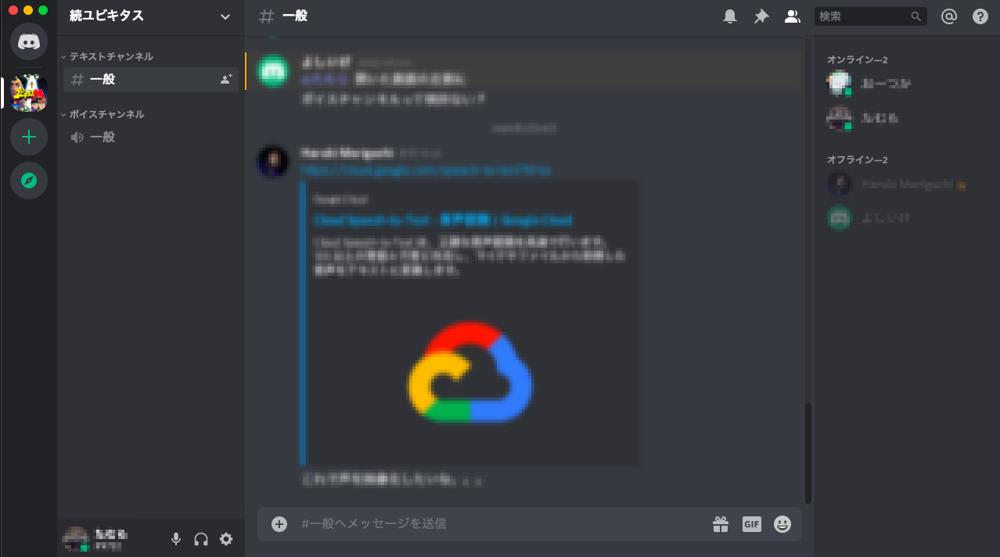

# Discordの使い方
## アプリを使用する場合は下記リンクからDownloadしてください。

|  Windows  |  Mac  |  Linux(deb)  |  Linux(tar.gz)  |  Andorid  |  iphone  |
| ---- | ---- | ---- | ---- | ---- | ---- |
|  )  |  )  | )  | )  | )  | )  |

## 接続先 : [続ユビキタス](https://discord.gg/GzrUdQ5) サーバ
## ボイスチャットのはじめ方
