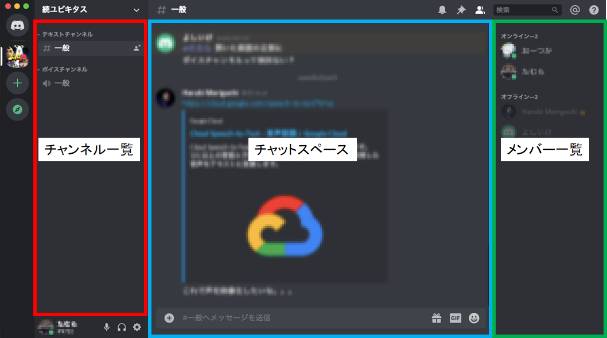
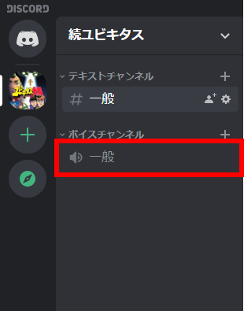
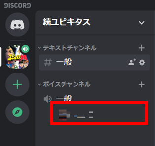
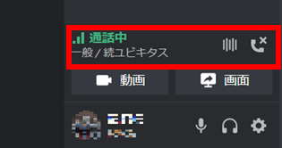

# Discordの使い方
## アプリを使用する場合は下記リンクからDownloadしてください。

|  Windows  |  Mac  |  Linux(deb)  |  Linux(tar.gz)  |  Andorid  |  iphone  |
| ---- | ---- | ---- | ---- | ---- | ---- |
|  )  |  )  | )  | )  | )  | )  |

## 接続先 : [続ユビキタス](http://localhost) サーバ
---
### 画面の説明
### PC編(Windows, Mac, Linux)

***
### スマホ編(Andorid, iphone)
###### そのうち作る

---
## ボイスチャットのはじめ方
### PC編(Windows, Mac, Linux)
ボイスチャットチャンネルから参加するチャンネルをクリック

クリックするとボイスチャットに参加することができます。

**通話中**になっていればOKです。

***
### スマホ編(Andorid, iphone)
###### そのうち作る

---
## 画面共有

## トラブルシューティング
---
- Q. 音声が聞こえない
- A. 
---
- Q. 
- A. 
---